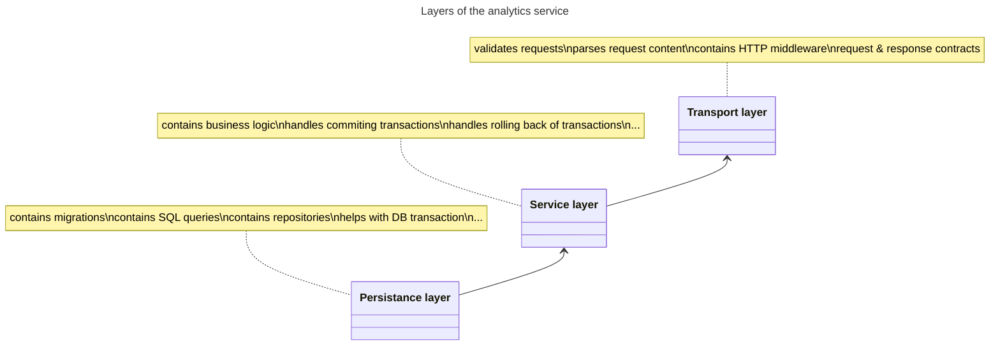
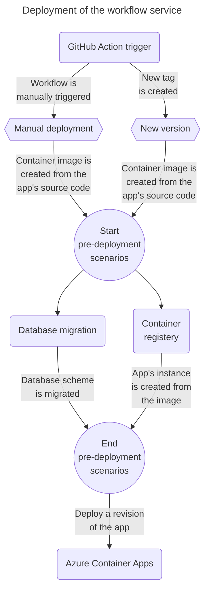

    

# Analytics service
A repository with an analytics service, that is part of Microservice Reference Framework.

## Project structure
### Service architecture

**Diagram catalog**:
- **Transport layer** - Is a layer responsible to handling incoming HTTP requests.
This means having functionality for unmarshalling request bodies, validating request data or validating JSON Web Tokens (JWTs).
- **Service layer** - This layer contains all the business logic of this service.
This can include constructing all the queries in a database transaction, publishing event to a message queue or realizing calculations on a set of data.
- **Persistance layer** - This layer is only responsible for dealing with a database.
This includes sending SQL queries to a database and retrieving responses, opening a connection to the database or providing functions for starting or commiting transactions.

## Deployment
This section contains information about analytics service's deployment process and environment.
### Deployment process
This section contains information about workflow service's deployment process and environment.

**Diagram catalog**:
- **GitHub Action trigger** - Starting point of the deployment process is a GitHub action for deploying the workflow service.
This action is triggered manually or when a new version/tag is created.
- **Manual deployment** - An event that represents a manual deployment of the workflow service.
- **New version** - An event representing an automatic deployment of the workflow service.
This event is triggered when a new version/tag has been created.
- **Container registry** - A registry for storing container images.
    - Examples: Docker hub or Azure Container Registry.
- **Azure Container Apps** - A cloud environment where this service is being hosted/deployed.
This environment has Dapr as a serverless service.
- **Database migration** - There is a mechanism for migrating database scheme to a new version.
This service uses so called `init container` to migrate the database.
